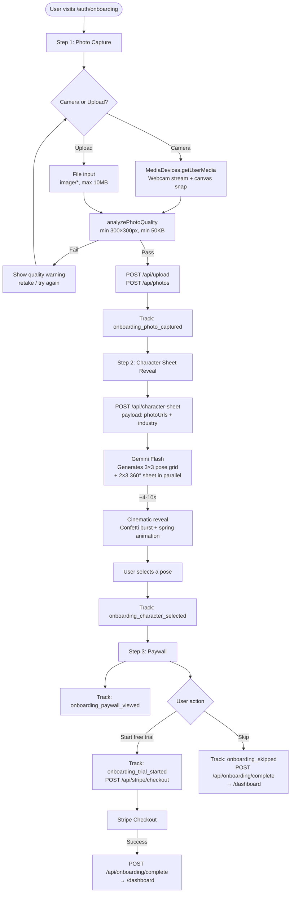
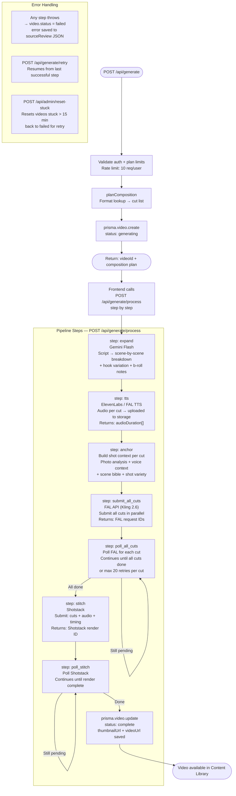
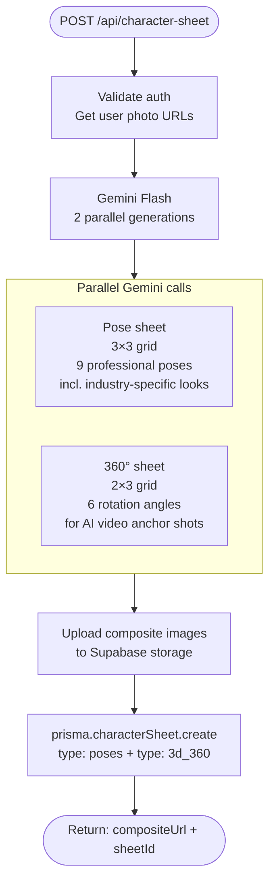

# Official AI — Pipeline Architecture

_Last updated: March 2026_

---

## Onboarding Flow (V2)

---

## Video Generation Pipeline

The pipeline is split into two HTTP calls to work around serverless timeouts:
- **POST /api/generate** — Fast (< 500ms): creates DB record, returns video ID
- **POST /api/generate/process** — Called repeatedly by the frontend, one step at a time

---

## Character Sheet Generation

---

## API Surface Summary

| Endpoint | Method | Purpose |
|----------|--------|---------|
| `/api/generate` | POST | Create video record + composition plan |
| `/api/generate/process` | POST | Run one pipeline step |
| `/api/generate/status` | GET | Current video status + step |
| `/api/generate/retry` | POST | Retry from last failed step |
| `/api/generate/advance` | POST | Force-advance to next step (admin) |
| `/api/generate/batch` | POST | Queue multiple videos |
| `/api/character-sheet` | POST | Generate character sheet |
| `/api/character-sheet` | GET | Get all character sheets for user |
| `/api/photos` | GET/POST | List / upload photos |
| `/api/photos/[id]` | DELETE | Delete a photo |
| `/api/voices` | GET/POST | List / upload voice samples |
| `/api/admin/reset-stuck` | GET/POST | Count / reset stuck generating videos |
| `/api/admin/pipeline-log` | GET | Pipeline event timeline for a video |
| `/api/events` | POST | Track lifecycle + onboarding funnel events |

---

## Onboarding Funnel Events

Tracked via `POST /api/events` → stored in `LifecycleEvent` table:

| Event | Fires When | Unique? |
|-------|-----------|---------|
| `onboarding_photo_captured` | Photo passes quality check + uploads | Yes (once) |
| `onboarding_character_selected` | User taps a pose | Yes (once) |
| `onboarding_paywall_viewed` | Paywall step mounts | Yes (once) |
| `onboarding_trial_started` | User clicks "Start free trial" | Yes (once) |
| `onboarding_skipped` | User clicks "Skip for now" | Yes (once) |

Drop-off rate = users who reach each event / users who started onboarding.
